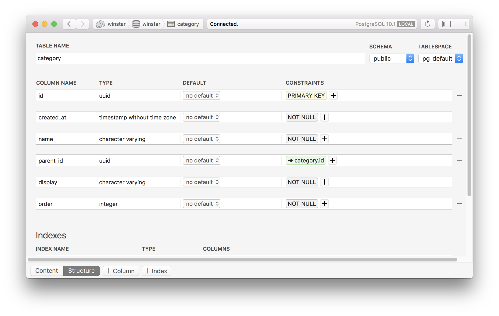

## tmux 사용관련 tip
#### ```.zshrc```설정에 추가할부분 
tmux를 그냥 키면 안돼! 그래서 shell 설정파일(```.zshrc``` 또는``` .zprofile```)에 다음을 추가한다.

```sh
alias tmux='tmux attach || tmux new'
```

#### tmux 세션 확인하는 명령어
```$ tmux list-sessions```

<br>
<br>

## git config에 alias설정하기
컴퓨터의 HOME폴더에서 ```.gitconfig```를 vim으로 연다.
그리고 다음과 같이 수정한다.

```
[user]
	name = Chul Whan Yoon
	email = suprech01@gmail.com
[alias]
  co = checkout
  br = branch
  ci = commit
  st = status
  lo = log --graph
[push]
  default = simple
```

```.gitconfig``` 수정의 경우, shell을 껐다 키지 않아도 적용이 된다는것에 유의하라.

<br>
<br>

## 오늘 한 일
1. ```item.py```수정
2. category 버그 수정
  * 버그란, 
3. alembic 다시 설정
  * 지난번 revision에서 column 명 설정부분 등이 반영이 안되어서 다시 작성하였음.
  * autogenerate를 이용하였다.
  * 혹여나 commit시 메세지를 잘못 작성하였다면, 
  ```winstar/migrations/versions``` 경로로 가서 방금 생성된 revision 파일을 삭제하면 된다. 그리고 다시 autogenerate를 하자.
  * alembic 명령어 수행시, ```alembic.ini```가 있는 디렉토리에서 수행해야 함을 명심하라.
  * autogenerate된 코드를 약간 다듬은 코드는 다음과 같다.

```python
"""change name for item model: add display column,
nullable change for price, storage

Revision ID: e821fd84e2f9
Revises: 7beaf518915d
Create Date: 2018-02-08 11:34:36.376873

"""
from alembic import op
import sqlalchemy as sa


# revision identifiers, used by Alembic.
revision = 'e821fd84e2f9'
down_revision = '7beaf518915d'
branch_labels = None
depends_on = None


def upgrade():
    op.add_column('item', sa.Column('display', sa.Boolean(), nullable=False))
    op.alter_column('item', 'price', nullable=True)
    op.alter_column('item', 'storage', nullable=True)


def downgrade():
    op.alter_column('item', 'storage', nullable=False)
    op.alter_column('item', 'price', nullable=False)
    op.drop_column('item', 'display')
```

<br>
<br>

## Category Table의 이해
* 우선, Category Table의 구조는 다음과 같다.



변경!


* 기본적으로 category를 전달해야 할 때는, full_name형태로 전달하도록 한다.
  * category 소속 record들은 모두 full_name메서드를 이용해서, parent 정보까지 모두 전달할 수 있다.('/'로 구분된다)

* 모든 category는 parent정보를 가지고 있다. root category라면 None을 가지고있는것이다. 그래서 다음의 코드가 있다.
```python
if category is None:
    return None
```

#### ```item.py```의 ```get_category()```이해하기
* 기본적으로 category명을 full_name형태로 집어넣어 주면, category 객체를 반환하기 위해 존재한다.
* 예를들어, 아래의 코드에서 ```Category.parent```의 rvalue로는 category 이름이 string형태로 들어가야 한다고 생각이 들 수 있으나, category 객체 그 자체를 대입해 주어도 된다. relationship으로 설정이 되어있기 때문. 

```python
def get_category(db, full_name):
    names = full_name.split('/')

    if names:
        category = None
        for name in names:
            category = db.query(Category) \
                .filter(Category.parent == category,
                        Category.name == name).first()
            if category is None:
                return None

    return category
```
<br>

Category 클래스의 코드는 다음과 같다. relationship 선언이 되어있어서 위와 같은 코드가 가능한것이다.
```python
class Category(Base):
    __tablename__ = 'category'

    ''' skip '''

    parent_id = Column(UUIDType, ForeignKey('category.id'), nullable=True)
    parent = relationship('Category',
                          foreign_keys=[parent_id],
                          remote_side=[id],
                          backref=backref('children'))

    ''' skip '''
```

<br>

####```add_category()``` 이해하기 - post_data의 형태의 차이
add의 경우 category 본연의 이름과, 어떤 parent를 지니고 있는지에 대한 정보가 따로온다. 즉, 다음과 같은 형태의 JSON 데이터를 post_data로 받았다고 가정하는 것이다.
```python
post_data = {
    'name': 'putters',
    'display': '퍼터',
    'parent': 'clubs',
}
```

이러한 형태는, ```update_category()```나 ```update_item()```과 같은데서 category를 사용하는것과는 사뭇 다른 방식이다.

```update_category()```의 경우 다음과 같이 post_data를 받는다.
```python
post_data = {
    'full_name': 'clubs/drivers',
    'order': 2
}
```

```update_item()```의 경우 다음과 같이 post_data를 받는다.
```python
post_data = {
    'name': 'Hello',
    'price': 1000,
    'id': str(item.id),
    'category': 'clubs/drivers'
  }
```


여기서 만약 parent가 없는 root category가 왔을경우를 커버하기 위해, ```add_category()```의 return JSON파일은 다음과 같이 되어있다.
```python
return jsonify(
    full_name=new_category.full_name,
    name=new_category.name,
    display=new_category.display,
    parent=new_category.parent and new_category.parent.full_name,
    order=new_category.order
)
```

``` parent=new_category.parent and new_category.parent.full_name```이 부분을 말하고자 하는것이다. 우리가 응답으로서 리턴해주는 category가 root category라면 ```parent = None```이 들어가게된다.

<br>
<br>

## 그 외 정리사항

1. 항상 수정을 했으면 바로 Merge하지 말고 Pull Request로 올리자. 그래야 다른 사람이 Review를 해줄 수 있다.

2. pytest 수행시, ```-x```옵션을 이용하면 문제가 발생한 지점 이후로는 더이상 실행하지 않고 바로 끝난다.
사용예시 : ```$ pytest -x --pdb```

3. ```and```의 용법
```item.py```의 74번째 줄에 다음과 같은 코드가 등장한다.
```parent=new_category.parent and new_category.parent.full_name```
즉, (blahblah) and (blahblah)는, 앞의것이 성립하면 뒤의것을 대입한다 라는 뜻이다.

4. 앞으로 category를 JSON형태로 넘겨주어야 할 일이 있을때는, 반드시 ```full_name```형태로 넘겨주도록 하자. 상위 category는 다르지만 하위 category는 같은 이름일 수 있기 때문이다.
> 예를들어 ```남성복/바지``` 와 ```여성복/바지```는 엄연히 다른 category이지만, ```name```은 같다. 이 때문에 ```full_name```으로 구분을 해 주어야 한다.

5. dictionary와 del 명령어
  * python에서 dictionary 값 하나를 날리고 싶을땐, 다음과 같이 해도 된다.
```python
post_data = {
    'name': 'putters',
    'display': '퍼터',
    'parent': 'clubs',
}
del post_data['parent']
```

6. dictionary 설정시 맨마지막 콤마(,)는 있어도 되고 없어도 된다.

7. 마크다운 이미지 업로드에 대해

만약 github의 README.md같은데에 보여지기 위한 이미지라면, 레포지토리의 폴더만 상대경로로 지정해서 다음과 같이 코드를 작성하면 된다. (images라는 폴더는 프로젝트 폴더 최상위에 존재한다고 가정)

```md

```

하지만, jekyll 블로그에 업로드 하기 위해서는 내 블로그의 주소도 써 주어야 한다. 다음과 같이 작성한다. 이와 관련된 도움말은 [링크][jekyll_img] 참조.

```md

```

<br>
<br>

## 앞으로 할 일 - 설계하기
모바일 클라이언트를 위한 mock api 만들기.
메모장 등으로 글로 작성. 원하는 방식으로!

다음 ui를 보고 작성하도록 하자. [링크][mobile_ui]


[mobile_ui]: https://docs.google.com/presentation/d/1r7a0SnAxTjg3P8yY2xFEuPGjamMdhrx92pZ432qI6DI/edit?ts=5a7bb2d6#slide=id.p

[jekyll_img]:https://jekyllrb-ko.github.io/docs/posts/#%EC%9D%B4%EB%AF%B8%EC%A7%80%EC%99%80-%EC%9E%90%EC%9B%90-%EC%82%BD%EC%9E%85%ED%95%98%EA%B8%B0